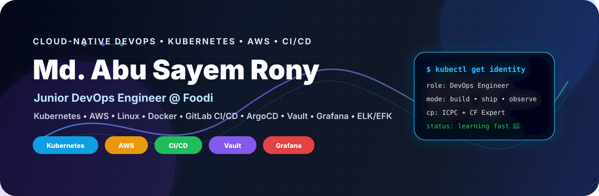
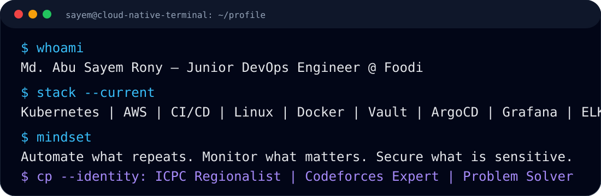
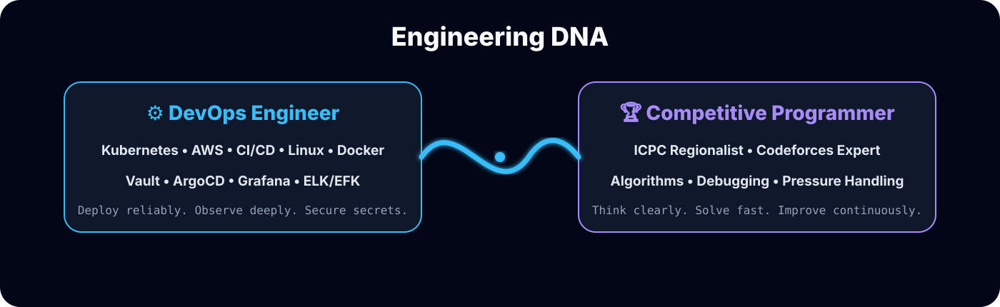
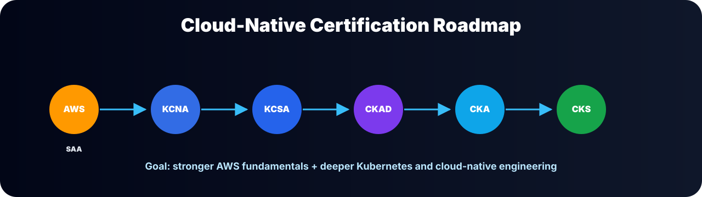
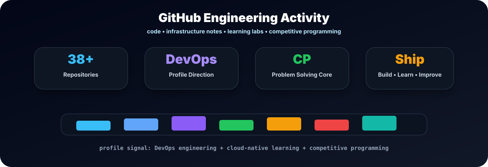

<!-- ========================================================= -->
<!--  Md. Abu Sayem Rony — GitHub Profile README Final Boss  -->
<!-- ========================================================= -->

<p align="center">
  
</p>

<p align="center">
  
</p>

<p align="center">
  <a href="https://linkedin.com/in/sayem19rony"></a>
  <a href="mailto:sayemiitju@gmail.com"></a>
  <a href="https://codeforces.com/profile/sayem_19"></a>
  <a href="https://www.codechef.com/users/sayem_18"></a>
  
</p>

---

<p align="center">
  
</p>

## 🚀 About Me

I am a **Junior DevOps Engineer currently working at Foodi**, after starting my DevOps journey at **TechnoNext**.

My work focuses on **Kubernetes, AWS, CI/CD, Linux, Docker, monitoring, secrets management, observability, and production support**. I work with Kubernetes-based service deployment and management across multiple environments including **development, staging, UAT, sandbox, and production-related environments**.

I am currently involved in **Kubernetes service migration**, **AWS infrastructure support**, **parallel CI/CD workflow improvements**, **Vault-based secret delivery for Kubernetes workloads**, **Grafana service graphs**, and **ELK/EFK-based logging and observability**.

Before DevOps, I built a strong foundation in **competitive programming**. As an **ICPC Regionalist** and **Codeforces Expert**, I developed strong problem-solving ability, debugging mindset, pressure-handling capability, and structured thinking — skills that help me solve real-world DevOps and production engineering challenges more effectively.

---

<p align="center">
  
</p>

## ⚙️ DevOps Arsenal

<p align="center">
  
</p>

<p align="center">
  
  
  
  
  
  
  
  
</p>

---

<p align="center">
  
</p>


## 🎯 Current Mission

```yaml
current_role: Junior DevOps Engineer @ Foodi

focus:
  - Kubernetes-based service deployment
  - AWS and production-related DevOps operations
  - CI/CD optimization with parallel pipeline execution
  - Vault-based secrets management for Kubernetes
  - Grafana service graphs and monitoring dashboards
  - ELK / EFK logging and observability
  - deployment troubleshooting and operational reliability

engineering_mindset:
  - automate what repeats
  - monitor what matters
  - secure what is sensitive
  - document what helps the team
  - improve what slows delivery
```


---


## 🛠️ What I Work With

<table>
  <tr>
    <td width="28%"><b>☁️ Cloud & Infrastructure</b></td>
    <td>
      
      
      
      
      
    </td>
  </tr>

  <tr>
    <td width="28%"><b>☸️ Containers & Orchestration</b></td>
    <td>
      
      
      
      
      
      
    </td>
  </tr>

  <tr>
    <td width="28%"><b>🚀 CI/CD & GitOps</b></td>
    <td>
      
      
      
      
      
      
    </td>
  </tr>

  <tr>
    <td width="28%"><b>🔐 Secrets Management</b></td>
    <td>
      
      
      
      
      
    </td>
  </tr>

  <tr>
    <td width="28%"><b>📊 Monitoring & Observability</b></td>
    <td>
      
      
      
      
      
      
      
    </td>
  </tr>

  <tr>
    <td width="28%"><b>🧩 Troubleshooting & Operations</b></td>
    <td>
      
      
      
      
      
      
    </td>
  </tr>

  <tr>
    <td width="28%"><b>🏆 Problem Solving</b></td>
    <td>
      
      
      
      
      
      
    </td>
  </tr>
</table>


## 🧪 Current Learning Roadmap

<p align="center">
  
</p>

<p align="center">
  <b>Current Priority:</b> AWS SAA first, then CNCF Kubernetes certifications with a long-term Kubestronaut-focused path.
</p>

<p align="center">
  
  
  
  
  
  
</p>

<p align="center">
  
</p>

<p align="center">
  <sub>
    Focused on strengthening AWS fundamentals, Kubernetes administration, cloud-native security, and production-grade DevOps engineering.
  </sub>
</p>


---


## 🧩 Competitive Programming

<p align="center">
  
  
  
  
  
</p>

I have solved **3500+ competitive programming problems** across different online judges and have participated in multiple onsite programming contests, including **ICPC regional-level contests**.

My competitive programming journey has helped me build a strong foundation in **algorithms, data structures, debugging, analytical thinking, pressure handling, and consistent problem-solving** — skills that also support my work in DevOps, troubleshooting, and production engineering.

<table>
  <tr>
    <td width="28%"><b>🏆 ICPC</b></td>
    <td><b>Regionalist</b> with onsite programming contest experience.</td>
  </tr>
  <tr>
    <td width="28%"><b>🔷 Codeforces</b></td>
    <td><b>Expert</b> competitive programmer.</td>
  </tr>
  <tr>
    <td width="28%"><b>👨‍🍳 CodeChef</b></td>
    <td><b>4★ Competitive Programmer</b> in <b>Div 2</b>.</td>
  </tr>
  <tr>
    <td width="28%"><b>🟢 AtCoder</b></td>
    <td><b>6 Kyu</b> competitive programmer.</td>
  </tr>
  <tr>
    <td width="28%"><b>🧠 Problem Solving</b></td>
    <td>Solved <b>3500+ problems</b> across online judges.</td>
  </tr>
</table>


<p align="center">
  <a href="https://codeforces.com/profile/sayem_19">
    
  </a>
  <a href="https://www.codechef.com/users/sayem_18">
    
  </a>
  <a href="https://atcoder.jp/users/SAYEM_16">
    
  </a>
</p>


## 📌 Portfolio Project Blueprint

<p align="center">
  
</p>

| Repository Idea | What It Should Demonstrate |
|---|---|
| `k8s-deployment-lab` | Kubernetes manifests, Services, Ingress, ConfigMaps, Secrets, troubleshooting notes |
| `ci-cd-pipeline-lab` | GitLab CI/CD, parallel pipeline design, release workflow, deployment verification |
| `vault-k8s-secrets` | HashiCorp Vault, Kubernetes secrets delivery, auto-unseal notes, secure configuration flow |
| `grafana-observability` | Prometheus metrics, Grafana dashboards, service graphs, monitoring notes |
| `elk-logging-lab` | Elasticsearch, Logstash/Fluent Bit, Kibana, log collection, search, and tuning notes |
| `competitive-programming-template` | C++ templates, algorithms, data structures, debugging utilities, CP setup |


---

## 📊 GitHub Analytics

<p align="center">
  
</p>

<p align="center">
  
</p>

---

<p align="center">
  
</p>

---

## 🤝 Connect With Me

<p align="center">
  <a href="https://linkedin.com/in/sayem19rony"></a>
  <a href="mailto:sayemiitju@gmail.com"></a>
  <a href="https://codeforces.com/profile/sayem_19"></a>
  <a href="https://www.codechef.com/users/sayem_18"></a>
</p>

---

<p align="center">
  
</p>
