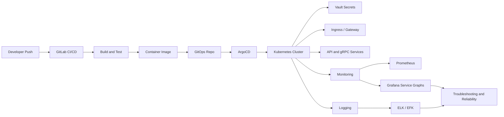
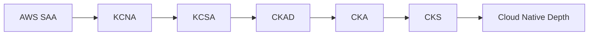

<!--
  GitHub Profile README for SAYEM-16T
  Theme: DevOps Engineer + Competitive Programmer
-->

<p align="center">
  
</p>

<p align="center">
  
</p>

<p align="center">
  <a href="https://linkedin.com/in/sayem19rony">
    
  </a>
  <a href="mailto:sayemiitju@gmail.com">
    
  </a>
  <a href="https://codeforces.com/profile/sayem_19">
    
  </a>
  <a href="https://www.codechef.com/users/sayem_18">
    
  </a>
</p>

<p align="center">
  
  
  
</p>

---

## 🚀 About Me

I am a **Junior DevOps Engineer currently working at Foodi**, after starting my DevOps journey at **TechnoNext**.

My work focuses on **Kubernetes, AWS, CI/CD, Linux, Docker, monitoring, secrets management, observability, and production support**. I work with Kubernetes-based service deployment and management across multiple environments including **development, staging, UAT, sandbox, and production-related environments**.

I am currently involved in **Kubernetes service deployment and migration**, **AWS infrastructure operations**, **parallel CI/CD pipeline improvements**, **Vault-based secrets management**, **Grafana service graphs**, and **ELK/EFK-based logging and observability**.

Before DevOps, I built a strong foundation in **competitive programming**. As an **ICPC Regionalist** and **Codeforces Expert**, I developed strong problem-solving ability, debugging mindset, pressure-handling capability, and structured thinking — skills that help me solve real-world DevOps and production engineering challenges more effectively.

<p align="center">
  <b>⚡ Fun fact ✨ try to use a system ⚫ never used by a system ✨</b>
</p>

---

## 🧬 My Engineering DNA

<table>
  <tr>
    <td width="50%" align="center">
      <h3>⚙️ DevOps Engineer</h3>
      <p>Kubernetes • AWS • CI/CD • Linux • Docker • Vault • ArgoCD • Grafana • ELK/EFK</p>
    </td>
    <td width="50%" align="center">
      <h3>🏆 Competitive Programmer</h3>
      <p>ICPC Regionalist • Codeforces Expert • Algorithms • Debugging • Problem Solving</p>
    </td>
  </tr>
</table>

---

## 🧠 Engineering Identity

```yaml
Name: Md. Abu Sayem Rony
Role: Junior DevOps Engineer
Currently Working At: Foodi
Started DevOps Journey At: TechnoNext

Core Focus:
  - Kubernetes
  - AWS
  - CI/CD
  - Linux
  - Docker
  - ArgoCD
  - Vault
  - Grafana
  - Prometheus
  - ELK / EFK
  - Production Support

Problem Solving Background:
  - ICPC Regionalist
  - Codeforces Expert
  - Competitive Programmer
  - Strong debugging and analytical thinking

Current Goal:
  - AWS Solutions Architect Associate
  - KCNA
  - KCSA
  - CKAD
  - CKA
  - CKS
  - Strong Kubernetes and cloud-native engineering
```

---

## 🛰️ DevOps Workflow I Work With



---

## 🎯 Current Mission

```yaml
Current Role: Junior DevOps Engineer @ Foodi

Mission:
  - Build reliable Kubernetes-based deployments
  - Improve CI/CD speed with parallel pipeline execution
  - Secure service secrets using HashiCorp Vault
  - Improve visibility with Grafana dashboards and service graphs
  - Strengthen logging and observability using ELK / EFK
  - Support production-related DevOps operations
  - Solve real-world deployment and infrastructure problems

Mindset:
  - Automate what repeats
  - Monitor what matters
  - Secure what is sensitive
  - Document what helps the team
  - Improve what slows delivery
```

---

## ⚙️ DevOps Arsenal

<p align="center">
  
</p>

<p align="center">
  
  
  
  
  
  
  
  
  
</p>

---

## 🛠️ What I Work With

<table>
  <tr>
    <td><b>Cloud & Infrastructure</b></td>
    <td>AWS, Linux servers, Proxmox, VMware ESXi, Nginx</td>
  </tr>
  <tr>
    <td><b>Containers & Orchestration</b></td>
    <td>Docker, Kubernetes, Helm, Kubernetes manifests</td>
  </tr>
  <tr>
    <td><b>CI/CD & GitOps</b></td>
    <td>GitLab CI/CD, parallel pipelines, ArgoCD, release workflows</td>
  </tr>
  <tr>
    <td><b>Secrets Management</b></td>
    <td>HashiCorp Vault, auto-unseal, Kubernetes secrets workflow, secure secret delivery</td>
  </tr>
  <tr>
    <td><b>Monitoring & Observability</b></td>
    <td>Grafana, Prometheus, ELK, EFK, logs, metrics, service graphs</td>
  </tr>
  <tr>
    <td><b>Problem Solving</b></td>
    <td>C++, Data Structures, Algorithms, Debugging, Competitive Programming</td>
  </tr>
</table>

---

## 🧩 Competitive Programming

<p align="center">
  
  
  
  
</p>

- ICPC Regionalist
- Codeforces Expert
- Experienced in onsite programming contests
- Strong foundation in algorithms, data structures, debugging, and analytical thinking

---

## 🧪 Current Learning Roadmap

<p align="center">
  
  
  
  
  
  
</p>



---

## 📌 Featured Engineering Areas

```bash
DevOps/
├── kubernetes/
│   ├── deployments
│   ├── services
│   ├── ingress
│   ├── configmaps
│   ├── secrets
│   └── troubleshooting
├── ci-cd/
│   ├── gitlab-pipelines
│   ├── parallel-execution
│   ├── release-workflows
│   └── deployment-verification
├── observability/
│   ├── grafana
│   ├── prometheus
│   ├── elk
│   ├── efk
│   └── service-graphs
├── security/
│   ├── vault
│   ├── auto-unseal
│   └── secret-delivery
└── problem-solving/
    ├── codeforces
    ├── codechef
    ├── icpc
    └── algorithms
```

---

## 🔥 Operational Mindset

<p align="center">
  
  
  
  
  
</p>

```text
Think clearly. Debug deeply. Automate carefully. Monitor continuously. Improve relentlessly.
```

---

## 📊 GitHub Analytics

<p align="center">
  
  
</p>

<p align="center">
  
</p>

---

## 📈 Contribution Activity

<p align="center">
  
</p>

---

## 🏆 GitHub Profile Trophy

<p align="center">
  
</p>

---

## 🐍 Contribution Snake

<p align="center">
  
</p>

---

## 🔥 Profile Summary

<p align="center">
  
</p>

<p align="center">
  
  
</p>

---

## 🤝 Connect With Me

<p align="center">
  <a href="https://linkedin.com/in/sayem19rony">
    
  </a>
  <a href="mailto:sayemiitju@gmail.com">
    
  </a>
  <a href="https://codeforces.com/profile/sayem_19">
    
  </a>
  <a href="https://www.codechef.com/users/sayem_18">
    
  </a>
</p>

---

<p align="center">
  
</p>

<p align="center">
  
</p>
